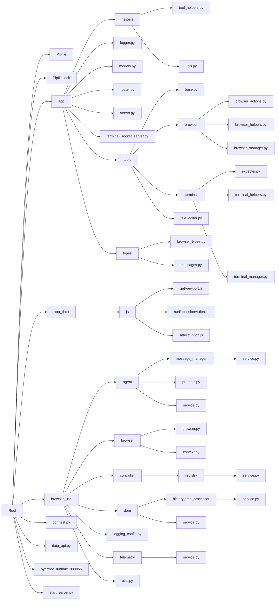
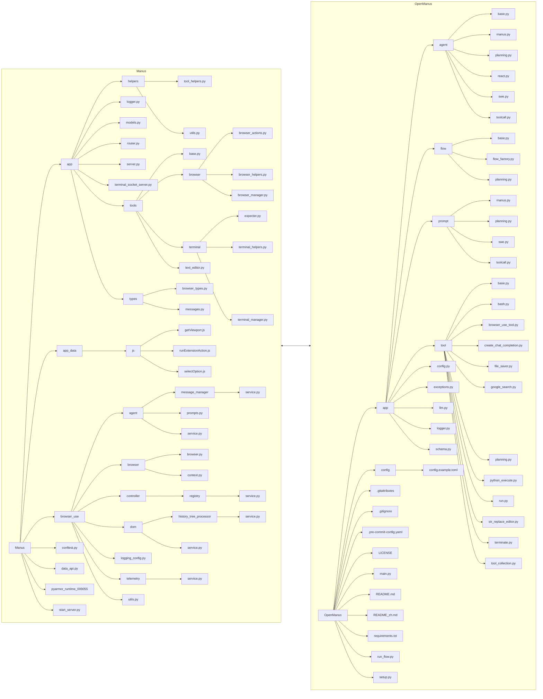

## Manus 项目结构

从朋友爬取的 Manus 项目内部结构来看，Manus 的大致结构似乎和 OpenManus 类似，这或许会慢慢成为未来 Agent 项目的构建方式。

```mermaid
flowchart LR
    root["Root"]
    Pipfile["Pipfile"]
    PipfileLock["Pipfile.lock"]
    app["app"]
    appHelpers["helpers"]
    appHelpersToolHelpers["tool_helpers.py"]
    appHelpersUtils["utils.py"]
    appLogger["logger.py"]
    appModels["models.py"]
    appRouter["router.py"]
    appServer["server.py"]
    appTerminalSocketServer["terminal_socket_server.py"]
    appTools["tools"]
    appToolsBase["base.py"]
    appToolsBrowser["browser"]
    appToolsBrowserActions["browser_actions.py"]
    appToolsBrowserHelpers["browser_helpers.py"]
    appToolsBrowserManager["browser_manager.py"]
    appToolsTerminal["terminal"]
    appToolsTerminalExpecter["expecter.py"]
    appToolsTerminalHelpers["terminal_helpers.py"]
    appToolsTerminalManager["terminal_manager.py"]
    appToolsTextEditor["text_editor.py"]
    appTypes["types"]
    appTypesBrowserTypes["browser_types.py"]
    appTypesMessages["messages.py"]
    appData["app_data"]
    appDataJs["js"]
    appDataJsGetViewport["getViewport.js"]
    appDataJsRunExtensionAction["runExtensionAction.js"]
    appDataJsSelectOption["selectOption.js"]
    browserUse["browser_use"]
    browserUseAgent["agent"]
    browserUseAgentMessageManager["message_manager"]
    browserUseAgentMessageManagerService["service.py"]
    browserUseAgentPrompts["prompts.py"]
    browserUseAgentService["service.py"]
    browserUseBrowser["browser"]
    browserUseBrowserBrowser["browser.py"]
    browserUseBrowserContext["context.py"]
    browserUseController["controller"]
    browserUseControllerRegistry["registry"]
    browserUseControllerRegistryService["service.py"]
    browserUseDom["dom"]
    browserUseDomHistoryTreeProcessor["history_tree_processor"]
    browserUseDomHistoryTreeProcessorService["service.py"]
    browserUseDomService["service.py"]
    browserUseLoggingConfig["logging_config.py"]
    browserUseTelemetry["telemetry"]
    browserUseTelemetryService["service.py"]
    browserUseUtils["utils.py"]
    conftest["conftest.py"]
    dataApi["data_api.py"]
    pyarmorRuntime["pyarmor_runtime_009055"]
    startServer["start_server.py"]

    root --> Pipfile
    root --> PipfileLock
    root --> app
    app --> appHelpers
    appHelpers --> appHelpersToolHelpers
    appHelpers --> appHelpersUtils
    app --> appLogger
    app --> appModels
    app --> appRouter
    app --> appServer
    app --> appTerminalSocketServer
    app --> appTools
    appTools --> appToolsBase
    appTools --> appToolsBrowser
    appToolsBrowser --> appToolsBrowserActions
    appToolsBrowser --> appToolsBrowserHelpers
    appToolsBrowser --> appToolsBrowserManager
    appTools --> appToolsTerminal
    appToolsTerminal --> appToolsTerminalExpecter
    appToolsTerminal --> appToolsTerminalHelpers
    appToolsTerminal --> appToolsTerminalManager
    appTools --> appToolsTextEditor
    app --> appTypes
    appTypes --> appTypesBrowserTypes
    appTypes --> appTypesMessages
    root --> appData
    appData --> appDataJs
    appDataJs --> appDataJsGetViewport
    appDataJs --> appDataJsRunExtensionAction
    appDataJs --> appDataJsSelectOption
    root --> browserUse
    browserUse --> browserUseAgent
    browserUseAgent --> browserUseAgentMessageManager
    browserUseAgentMessageManager --> browserUseAgentMessageManagerService
    browserUseAgent --> browserUseAgentPrompts
    browserUseAgent --> browserUseAgentService
    browserUse --> browserUseBrowser
    browserUseBrowser --> browserUseBrowserBrowser
    browserUseBrowser --> browserUseBrowserContext
    browserUse --> browserUseController
    browserUseController --> browserUseControllerRegistry
    browserUseControllerRegistry --> browserUseControllerRegistryService
    browserUse --> browserUseDom
    browserUseDom --> browserUseDomHistoryTreeProcessor
    browserUseDomHistoryTreeProcessor --> browserUseDomHistoryTreeProcessorService
    browserUseDom --> browserUseDomService
    browserUse --> browserUseLoggingConfig
    browserUse --> browserUseTelemetry
    browserUseTelemetry --> browserUseTelemetryService
    browserUse --> browserUseUtils
    root --> conftest
    root --> dataApi
    root --> pyarmorRuntime
    root --> startServer
```

---

## Manus vs OpenManus

```mermaid
graph LR

subgraph left["Manus"]
	direction LR
    root["Manus"]
    app["app"]
    appHelpers["helpers"]
    appHelpersToolHelpers["tool_helpers.py"]
    appHelpersUtils["utils.py"]
    appLogger["logger.py"]
    appModels["models.py"]
    appRouter["router.py"]
    appServer["server.py"]
    appTerminalSocketServer["terminal_socket_server.py"]
    appTools["tools"]
    appToolsBase["base.py"]
    appToolsBrowser["browser"]
    appToolsBrowserActions["browser_actions.py"]
    appToolsBrowserHelpers["browser_helpers.py"]
    appToolsBrowserManager["browser_manager.py"]
    appToolsTerminal["terminal"]
    appToolsTerminalExpecter["expecter.py"]
    appToolsTerminalHelpers["terminal_helpers.py"]
    appToolsTerminalManager["terminal_manager.py"]
    appToolsTextEditor["text_editor.py"]
    appTypes["types"]
    appTypesBrowserTypes["browser_types.py"]
    appTypesMessages["messages.py"]
    appData["app_data"]
    appDataJs["js"]
    appDataJsGetViewport["getViewport.js"]
    appDataJsRunExtensionAction["runExtensionAction.js"]
    appDataJsSelectOption["selectOption.js"]
    browserUse["browser_use"]
    browserUseAgent["agent"]
    browserUseAgentMessageManager["message_manager"]
    browserUseAgentMessageManagerService["service.py"]
    browserUseAgentPrompts["prompts.py"]
    browserUseAgentService["service.py"]
    browserUseBrowser["browser"]
    browserUseBrowserBrowser["browser.py"]
    browserUseBrowserContext["context.py"]
    browserUseController["controller"]
    browserUseControllerRegistry["registry"]
    browserUseControllerRegistryService["service.py"]
    browserUseDom["dom"]
    browserUseDomHistoryTreeProcessor["history_tree_processor"]
    browserUseDomHistoryTreeProcessorService["service.py"]
    browserUseDomService["service.py"]
    browserUseLoggingConfig["logging_config.py"]
    browserUseTelemetry["telemetry"]
    browserUseTelemetryService["service.py"]
    browserUseUtils["utils.py"]
    conftest["conftest.py"]
    dataApi["data_api.py"]
    pyarmorRuntime["pyarmor_runtime_009055"]
    startServer["start_server.py"]

    root --> app
    app --> appHelpers
    appHelpers --> appHelpersToolHelpers
    appHelpers --> appHelpersUtils
    app --> appLogger
    app --> appModels
    app --> appRouter
    app --> appServer
    app --> appTerminalSocketServer
    app --> appTools
    appTools --> appToolsBase
    appTools --> appToolsBrowser
    appToolsBrowser --> appToolsBrowserActions
    appToolsBrowser --> appToolsBrowserHelpers
    appToolsBrowser --> appToolsBrowserManager
    appTools --> appToolsTerminal
    appToolsTerminal --> appToolsTerminalExpecter
    appToolsTerminal --> appToolsTerminalHelpers
    appToolsTerminal --> appToolsTerminalManager
    appTools --> appToolsTextEditor
    app --> appTypes
    appTypes --> appTypesBrowserTypes
    appTypes --> appTypesMessages
    root --> appData
    appData --> appDataJs
    appDataJs --> appDataJsGetViewport
    appDataJs --> appDataJsRunExtensionAction
    appDataJs --> appDataJsSelectOption
    root --> browserUse
    browserUse --> browserUseAgent
    browserUseAgent --> browserUseAgentMessageManager
    browserUseAgentMessageManager --> browserUseAgentMessageManagerService
    browserUseAgent --> browserUseAgentPrompts
    browserUseAgent --> browserUseAgentService
    browserUse --> browserUseBrowser
    browserUseBrowser --> browserUseBrowserBrowser
    browserUseBrowser --> browserUseBrowserContext
    browserUse --> browserUseController
    browserUseController --> browserUseControllerRegistry
    browserUseControllerRegistry --> browserUseControllerRegistryService
    browserUse --> browserUseDom
    browserUseDom --> browserUseDomHistoryTreeProcessor
    browserUseDomHistoryTreeProcessor --> browserUseDomHistoryTreeProcessorService
    browserUseDom --> browserUseDomService
    browserUse --> browserUseLoggingConfig
    browserUse --> browserUseTelemetry
    browserUseTelemetry --> browserUseTelemetryService
    browserUse --> browserUseUtils
    root --> conftest
    root --> dataApi
    root --> pyarmorRuntime
    root --> startServer
end

subgraph right["OpenManus"]
	direction LR
	    om_root["OpenManus"]
    om_app["app"]
    om_appAgent["agent"]
    om_appAgentBase["base.py"]
    om_appAgentManus["manus.py"]
    om_appAgentPlanning["planning.py"]
    om_appAgentReact["react.py"]
    om_appAgentSwe["swe.py"]
    om_appAgentToolcall["toolcall.py"]
    om_appFlow["flow"]
    om_appFlowBase["base.py"]
    om_appFlowFlowFactory["flow_factory.py"]
    om_appFlowPlanning["planning.py"]
    om_appPrompt["prompt"]
    om_appPromptManus["manus.py"]
    om_appPromptPlanning["planning.py"]
    om_appPromptSwe["swe.py"]
    om_appPromptToolcall["toolcall.py"]
    om_appTool["tool"]
    om_appToolBase["base.py"]
    om_appToolBash["bash.py"]
    om_appToolBrowserUseTool["browser_use_tool.py"]
    om_appToolCreateChatCompletion["create_chat_completion.py"]
    om_appToolFileSaver["file_saver.py"]
    om_appToolGoogleSearch["google_search.py"]
    om_appToolPlanning["planning.py"]
    om_appToolPythonExecute["python_execute.py"]
    om_appToolRun["run.py"]
    om_appToolStrReplaceEditor["str_replace_editor.py"]
    om_appToolTerminate["terminate.py"]
    om_appToolToolCollection["tool_collection.py"]
    om_appConfig["config.py"]
    om_appExceptions["exceptions.py"]
    om_appLlm["llm.py"]
    om_appLogger["logger.py"]
    om_appSchema["schema.py"]
    om_config["config"]
    om_configExample["config.example.toml"]
    om_gitattributes[".gitattributes"]
    om_gitignore[".gitignore"]
    om_preCommitConfig[".pre-commit-config.yaml"]
    om_license["LICENSE"]
    om_main["main.py"]
    om_readme["README.md"]
    om_readmeZh["README_zh.md"]
    om_requirements["requirements.txt"]
    om_runFlow["run_flow.py"]
    om_setup["setup.py"]

    om_root --> om_app
    om_app --> om_appAgent
    om_appAgent --> om_appAgentBase
    om_appAgent --> om_appAgentManus
    om_appAgent --> om_appAgentPlanning
    om_appAgent --> om_appAgentReact
    om_appAgent --> om_appAgentSwe
    om_appAgent --> om_appAgentToolcall
    om_app --> om_appFlow
    om_appFlow --> om_appFlowBase
    om_appFlow --> om_appFlowFlowFactory
    om_appFlow --> om_appFlowPlanning
    om_app --> om_appPrompt
    om_appPrompt --> om_appPromptManus
    om_appPrompt --> om_appPromptPlanning
    om_appPrompt --> om_appPromptSwe
    om_appPrompt --> om_appPromptToolcall
    om_app --> om_appTool
    om_appTool --> om_appToolBase
    om_appTool --> om_appToolBash
    om_appTool --> om_appToolBrowserUseTool
    om_appTool --> om_appToolCreateChatCompletion
    om_appTool --> om_appToolFileSaver
    om_appTool --> om_appToolGoogleSearch
    om_appTool --> om_appToolPlanning
    om_appTool --> om_appToolPythonExecute
    om_appTool --> om_appToolRun
    om_appTool --> om_appToolStrReplaceEditor
    om_appTool --> om_appToolTerminate
    om_appTool --> om_appToolToolCollection
    om_app --> om_appConfig
    om_app --> om_appExceptions
    om_app --> om_appLlm
    om_app --> om_appLogger
    om_app --> om_appSchema
    om_root --> om_config
    om_config --> om_configExample
    om_root --> om_gitattributes
    om_root --> om_gitignore
    om_root --> om_preCommitConfig
    om_root --> om_license
    om_root --> om_main
    om_root --> om_readme
    om_root --> om_readmeZh
    om_root --> om_requirements
    om_root --> om_runFlow
    om_root --> om_setup
end

    %% 强制左右排列
    left <----> right
```